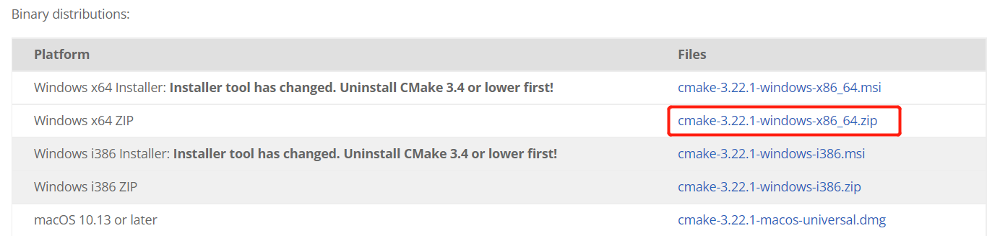
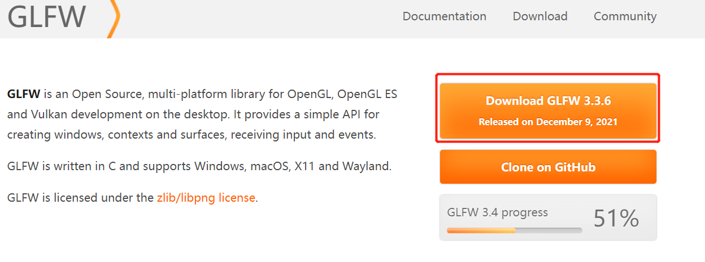
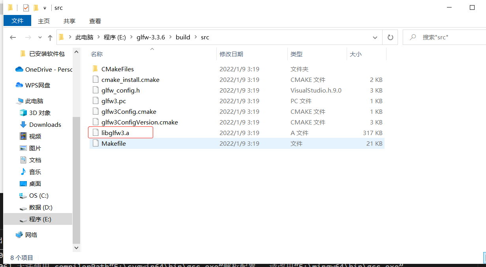
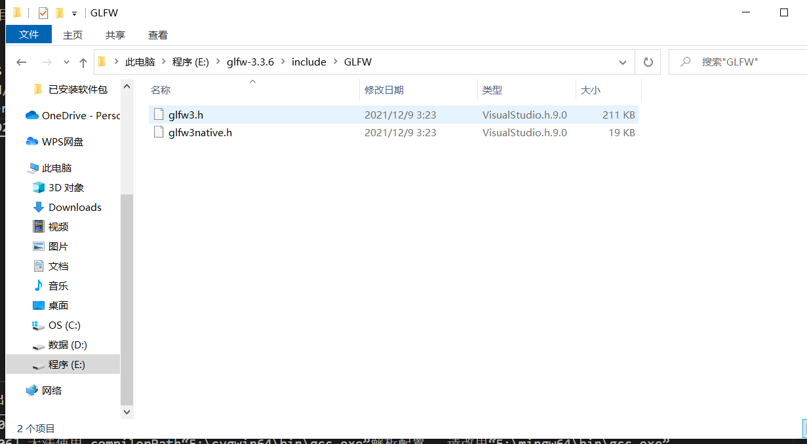
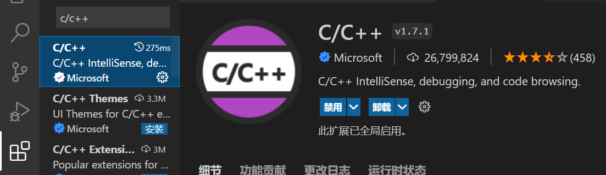
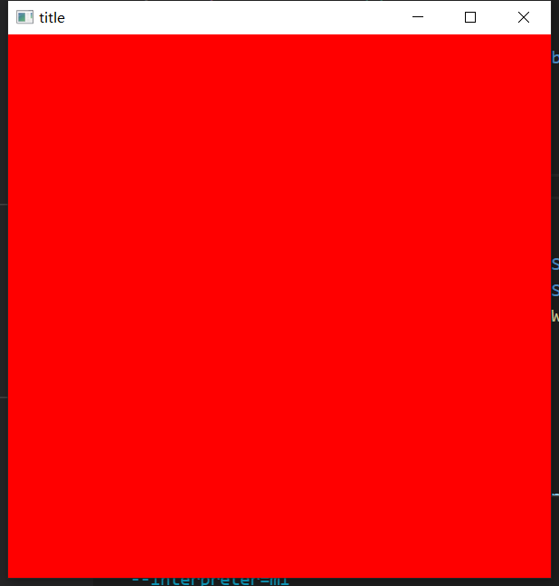

# 计算机图形学c++编程环境配置(visual studio code)
本来使用[cygwin](https://zh.wikipedia.org/wiki/Cygwin)搭建的开发环境，摸索了老半天程序终于能正常编译链接了，但是无法正常运行(glfw初始化失败导致，不清楚什么原因)。所以改用[mingw-64](https://zh.wikipedia.org/wiki/MinGW)搭建，以下是搭建过程。

---

## 下载安装mingw-64
> 参考[在windows上安装MinGW-w64](https://shaogui.life/2021/03/10/windows%E4%B8%8A%E5%AE%89%E8%A3%85minGW/)(*不建议使用网络安装器安装，因为国内网络的问题下载很慢，建议直接下载压缩包*)或[MinGW-w64安装教程](https://www.jianshu.com/p/d66c2f2e3537)

安装后把mingw-64的bin目录添加到path环境变量

## 编译glfw
> 参考[glfw官网编译手册](https://www.glfw.org/docs/latest/compile_guide.html)

1. 下载安装cmake

    官网有制作好的二进制文件，这里选择压缩包版，下载后解压即可，最后记得把bin目录配置到path环境变量
2. 下载glfw源码

    
3. 解压后进入glfw源码目录执行下面构建命令(*注意目录所在路径中不要有中文*)：
        
        cmake -S ./ -B ./build -G "MinGW Makefiles"
        cd build/
        mingw32-make
    构建后的静态链接库文件

    
    源码中的头文件

    

## vscode编程环境配置
1. 安装c/c++插件

    
2. 配置c/c++插件

    打开命令面板`ctrl+shift+p`执行`C/C++: Edit Configurations (JSON)`命令，修改配置如下：
    
        {
            "configurations": [
                {
                    "name": "Win32",
                    //包含目录
                    "includePath": [
                        "${workspaceFolder}/**"
                    ],
                    "defines": [
                        "_DEBUG",
                        "UNICODE",
                        "_UNICODE"
                    ],
                    //编译器路径
                    "compilerPath": "E:\\mingw64\\bin\\gcc.exe",
                    "cStandard": "gnu17",
                    "cppStandard": "gnu++17",
                    "intelliSenseMode": "linux-gcc-x64"
                }
            ],
            "version": 4
        }
3. 配置构建任务   

    打开任意一个cpp文件，选择`终端`-`配置任务`，选择`C/C++: g++.exe 生成活动文件`，修改配置如下：

        {
            "version": "2.0.0",
            "tasks": [
                {
                    "type": "cppbuild",
                    "label": "C/C++: g++.exe 生成活动文件",
                    "command": "E:\\mingw64\\bin\\g++.exe",
                    "args": [
                        "-fdiagnostics-color=always",
                        //用于产生gdb调试信息
                        "-g",
                        "${file}",
                        "-o",
                        "${fileDirname}\\${fileBasenameNoExtension}.exe",
                        //直接指定链接库的全路径
                        // "${workspaceFolder}\\lib\\libglfw3.a",
                        // "${workspaceFolder}\\lib\\glew32.lib",
                        //或指定链接库的名称(去掉lib前缀和.a后缀),需要配合-L选项
                        "-lglfw3",
                        //opengl一般操作系统自带，直接用
                        "-lopengl32",
                        //不知道什么库，但不指定编译链接不通过
                        "-lgdi32",
                        //库目录
                        "-L${workspaceFolder}\\lib",
                        //包含文件目录
                        "-I${workspaceFolder}\\include"
                    ],
                    "options": {
                        "cwd": "${fileDirname}"
                    },
                    "problemMatcher": [
                        "$gcc"
                    ],
                    "group": {
                        "kind": "build",
                        "isDefault": true
                    },
                    "detail": "编译器: E:\\mingw64\\bin\\g++.exe"
                }
            ]
        }
4. 程序运行配置

    打开任意一个cpp文件，选择`运行`-`添加配置`，选择`C++(Windows)`，修改配置如下：
    
        {
            // 使用 IntelliSense 了解相关属性。 
            // 悬停以查看现有属性的描述。
            // 欲了解更多信息，请访问: https://go.microsoft.com/fwlink/?linkid=830387
            "version": "0.2.0",
            "configurations": [
                {
                    "name": "(gdb) 启动",
                    "type": "cppdbg",
                    "request": "launch",
                    "program": "${fileDirname}\\${fileBasenameNoExtension}.exe",
                    "args": [],
                    "stopAtEntry": false,
                    "cwd": "${fileDirname}",
                    "environment": [],
                    "externalConsole": false,
                    "MIMode": "gdb",
                    //调试程序的路径
                    "miDebuggerPath": "E:\\mingw64\\bin\\gdb.exe",
                    "setupCommands": [
                        {
                            "description": "为 gdb 启用整齐打印",
                            "text": "-enable-pretty-printing",
                            "ignoreFailures": true
                        }
                    ],
                    //开始调试前执行的任务
                    "preLaunchTask":"C/C++: g++.exe 生成活动文件"
                }
            ]
        }

## 环境测试
项目目录结构：

    demo
        │  main.cpp
        │
        ├─.vscode
        │      c_cpp_properties.json
        │      launch.json
        │      tasks.json
        │
        ├─include
        │  └─GLFW
        │          glfw3.h
        │          glfw3native.h
        │
        └─lib
                libglfw3.a

main.cpp：

    #include <GLFW/glfw3.h>
    #include <iostream>
    using namespace std;
    void init(GLFWwindow* window){}
    void display(GLFWwindow* window,double currentTime){
        glClearColor(1.0,0.0,0.0,1.0);
        glClear(GL_COLOR_BUFFER_BIT);
    }
    int main() {
        if(!glfwInit()){
            exit(EXIT_FAILURE);
        }
        glfwWindowHint(GLFW_CONTEXT_VERSION_MAJOR,4);
        glfwWindowHint(GLFW_CONTEXT_VERSION_MINOR,3);
        GLFWwindow* window = glfwCreateWindow(600,600,"title",NULL,NULL);
        glfwMakeContextCurrent(window);
        glfwSwapInterval(1);
        init(window);
        while(!glfwWindowShouldClose(window)){
            display(window,glfwGetTime());
            glfwSwapBuffers(window);
            glfwPollEvents();
        }
        glfwDestroyWindow(window);
        glfwTerminate();
        exit(EXIT_SUCCESS);
    }
打开main.cpp，按下`F5`运行程序结果如下图说明环境搭建成功；

